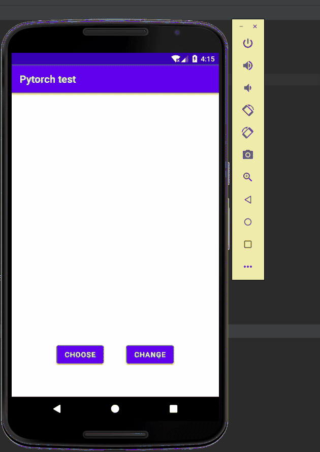

# pytorch mobile trial
 pytorch mobile trial with a self-trained gan(U-GAT-IT,[pytorch version](https://github.com/znxlwm/UGATIT-pytorch)) , to make a person looks more beautiful

 Training and test datasets are generated by [styleGANv2](https://github.com/a312863063/generators-with-stylegan2)

 ## Effects:

# Tips

### 0. not only girls ,but also boys works.

### 1. trained pytorch model should be converted via this method:

    inut_tensor = torch.rand(1,3,256,256)
    mobile = torch.jit.trace(processedModel,inut_tensor)
    mobile.save("test2.pt")

processedModel is your model file and loaded by pytorch.

### 2. this model is just trained 28000 epochs(not very good).

### 3. "test2.pt" should be placed under fold "assets"

### 4. to get better results, should crop face from the images first ,it is hard to do image processing on mobiles for me. :(

